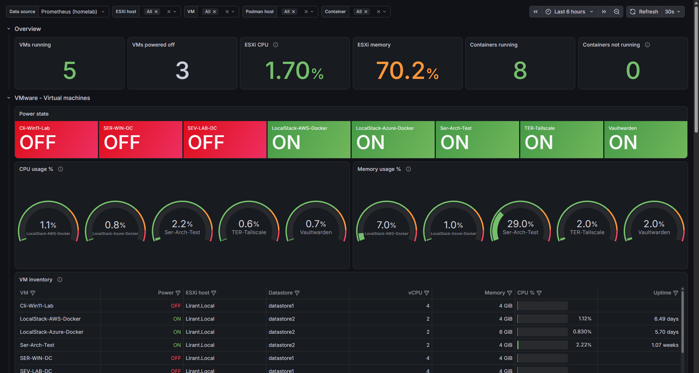
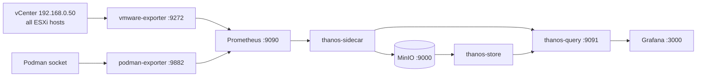
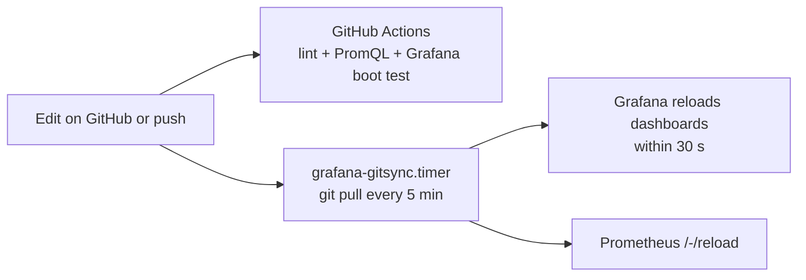

# homelab-grafana-iac

[](https://github.com/lirant10/homelab-grafana-iac/actions/workflows/validate.yml)

My home lab monitoring stack, fully defined as code.
One Grafana dashboard shows **VMware ESXi** (hosts, VMs, datastores) and **Podman containers** side by side,
and everything behind it – Grafana, Prometheus, Thanos, MinIO and the exporters – runs as rootless
**Podman Quadlets** from this repo.



## How it works



- **Prometheus** scrapes the two exporters.
- **Thanos sidecar** ships Prometheus blocks to **MinIO** (S3) for long-term storage; **Thanos store** reads them back.
- **Thanos query** merges recent + historical data. Grafana only talks to Thanos query.

### GitOps loop



Dashboards and `prometheus.yml` are read straight from this checkout, so a merged change is live
within a few minutes – no SSH needed.

## What's on the dashboard

| Row | Panels |
|---|---|
| Overview | VMs running / off, ESXi CPU & memory, containers running / not running |
| VMware – VMs | power state, CPU % & memory % gauges, VM inventory table, CPU over time, CPU ready, network, disk I/O, guest disk usage |
| VMware – hosts | host CPU %, host memory %, datastore usage |
| Podman | containers table (state, image, CPU, memory, uptime), CPU, memory, network, block I/O |

Filters: **Data source**, **ESXi host**, **VM**, **Podman host**, **Container**.

## Repo layout

```
dashboards/homelab/            dashboard JSON (folder name = Grafana folder)
provisioning/                  Grafana provisioning: data source + dashboard provider
deploy/prometheus/             prometheus.yml (mounted into the Prometheus container)
deploy/quadlets/               every container of the stack as a Podman Quadlet
deploy/systemd/                git-sync timer (auto-deploy from GitHub)
scripts/validate.py            lint checks used by CI
scripts/export-dashboard.sh    pull a dashboard from the Grafana API into the repo
.github/workflows/validate.yml CI
```

| Service | Port | Quadlet |
|---|---|---|
| Grafana | 3000 | `grafana.container` + `grafana-data.volume` |
| Prometheus | 9090 | `prometheus.container` |
| Thanos query | 9091 | `thanos-query.container` |
| Thanos sidecar / store | – | `thanos-sidecar.container`, `thanos-store.container` |
| MinIO (API / console) | 9000 / 9001 | `minio.container` |
| vmware-exporter | 9272 | `vmware-exporter.container` |
| podman-exporter | 9882 | `podman-exporter.container` |

MinIO and Thanos share a private Podman network (`thanos.network`) and reach each other by container name.

## Secrets

No credentials are stored in this repo. They live in Podman secrets (and in my Vaultwarden):

| Secret / file | Used by |
|---|---|
| `grafana_admin_password` | Grafana admin login |
| `minio_root_user`, `minio_root_password` | MinIO |
| `thanos_bucket` | Thanos objstore config (`bucket.yml` with MinIO keys) |
| `~/.config/vmware-exporter/config.yml` | vSphere credentials for vmware-exporter (kept outside Git) |

`config.yml` needs a `vcenter:` section, because Prometheus scrapes vCenter with `?section=vcenter`.
A read-only vCenter user is enough:

```yaml
default:
  vsphere_host: 192.168.0.50
  vsphere_user: prometheus@lirant.local
  vsphere_password: "..."
  ignore_ssl: True
vcenter:
  vsphere_host: 192.168.0.50
  vsphere_user: prometheus@lirant.local
  vsphere_password: "..."
  ignore_ssl: True
  collect_only:
    vms: True
    vmguests: True
    datastores: True
    hosts: True
    snapshots: True
```

```bash
read -rsp 'value: ' V && printf '%s' "$V" | podman secret create <name> - && unset V; echo
podman secret create thanos_bucket ./bucket.yml
```

## Setup from scratch

```bash
git clone https://github.com/lirant10/homelab-grafana-iac.git ~/homelab-grafana-iac
cd ~/homelab-grafana-iac

# 1. create the secrets above, and ~/.config/vmware-exporter/config.yml

# 2. data folders
mkdir -p ~/.config/prometheus/data ~/thanos-lab/minio-data
podman unshare chown 65534:65534 ~/.config/prometheus/data   # Prometheus runs as "nobody"

# 3. install the stack
mkdir -p ~/.config/containers/systemd ~/.config/systemd/user
cp deploy/quadlets/* ~/.config/containers/systemd/
cp deploy/systemd/*  ~/.config/systemd/user/
systemctl --user enable --now podman.socket
loginctl enable-linger "$USER"          # start user services at boot, without login
systemctl --user daemon-reload
systemctl --user start minio prometheus thanos-sidecar thanos-store thanos-query \
                       grafana vmware-exporter podman-exporter
systemctl --user enable --now grafana-gitsync.timer
```

Then open Grafana on `:3000` → **Dashboards → homelab → VMware & Podman Infrastructure**.
Check `:9090/targets` (both jobs **UP**) and `:9091/stores` (sidecar + store **UP**).

## Day-to-day workflow

| Change | How it gets deployed |
|---|---|
| Dashboard JSON | push → timer pulls → Grafana reloads (≤ 5 min) |
| `prometheus.yml` | push → timer pulls → Prometheus `/-/reload` |
| A Quadlet file | push, then on the host: `cp` to `~/.config/containers/systemd/`, `systemctl --user daemon-reload`, restart the service |

Provisioned dashboards are read-only in the UI on purpose, so the UI and Git can't drift.
To change one visually: edit it in Grafana → **Save** → copy the JSON Grafana offers → commit it here.

## CI

Every push runs `.github/workflows/validate.yml`:

- `validate.py` – valid JSON/YAML, unique panel IDs, no hard-coded datasource UIDs
- `promtool check rules` – every PromQL query in the dashboard parses
- boots a real Grafana container with this repo's provisioning and checks the dashboard and data source load without errors

## Lessons learned

- **Label mismatch = duplicate table rows.** Thanos adds `cluster`/`replica` labels and exporters add their own,
  so every table query is aggregated to a fixed label set (`max by (vm_name, host_name, ds_name)`) before Grafana merges them.
- **Quadlets without `[Install]` don't start at boot.** And rootless services also need `loginctl enable-linger`.
- **Arch + rootless Podman:** after upgrading `podman`/`passt`, restart long-running containers –
  an old container kept an old network helper and couldn't reach `host.containers.internal` any more.
- **Mount directories, not single files,** for anything `git pull` updates – Git replaces the file,
  and a single-file bind mount keeps pointing at the old one.
